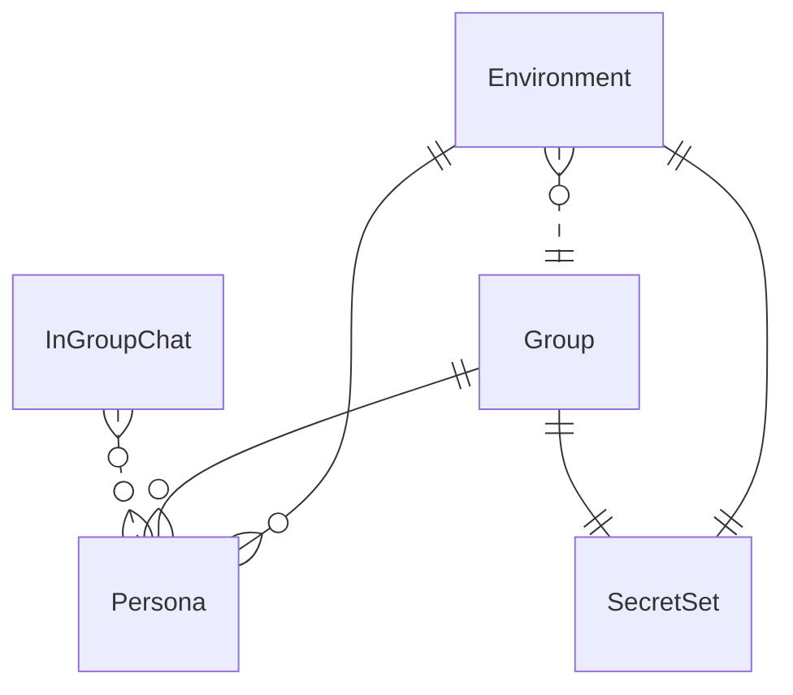

{/* Generated by `modelith render`. Do not edit by hand; edit the .modelith.yaml source and re-render. */}

# tellme — Environment Management (the external Niffler manager)

Models how tellme environments are provisioned and run. Unlike the product and quality models, the machinery here lives **outside** this repository: a Niffler-style shell manager (`tellme.sh`) provisions an isolated `ait-<tag>/` workspace from a self-contained group template, generating one config per persona and sourcing a provider that can be hot-swapped mid-session. tellme consumes the provisioned directory as `$TELL_ME_HOME`; the manager is a recorded external dependency, not part of the binary.

## Glossary

- **`HotSwap`** — Switching the active provider within an environment without losing session state, because the provider is never encoded in the directory name.
- **`MODE`** — A config key naming a persona's identity (e.g. `butler`). `TELL_ME_MODE` selects the mode for tellme's offline session commands.
- **`Niffler`** — The external shell manager that provisions and sources a tellme environment from a group template. It lives at `~/tmp/dualnets/seed/notebooks/<host>-niffler/tellme.sh` — outside this repository — and is invoked via `source tellme.sh`. A recorded divergence: the reference ships its own Niffler; tellme's is external.
- **`PERSON`** — A config key holding a persona's system prompt, injected as the system message on every turn.
- **`TellMeHome`** — The provisioned environment directory (`ait-<tag>/`) that tellme reads as `$TELL_ME_HOME` — its `configs/`, `docs/skills/`, `secrets/`, and per-mode `output/<mode>/` workspaces. Fixed at provisioning time.

## Enums

### `ProvisionFlag`

Flags that modify how an environment is provisioned.

| Value | Definition |
| --- | --- |
| `priority` | Use the priority-tier merge source (shared/priority provider headers). |
| `clean` | Skip copying the group's `docs/` (a lean, skills-free environment). |

## Entities

### `Environment`

A self-contained `ait-<tag>/` directory provisioned from exactly one `Group`. Its `tag` fixes the directory name; only the active provider changes. It holds the generated persona configs, the `SecretSet`, the optional `docs/skills/` catalog, and the per-mode `output/<mode>/` workspaces. tellme treats it as `TellMeHome` (`$TELL_ME_HOME`).

**Relationships**

- `Group` — n:1 — referenced — The group template this environment was provisioned from.
- `Persona` — 1:n — owned — The generated per-persona configs.
- `SecretSet` — 1:1 — owned — The environment's copied credentials.

**Attributes**

| Name | Type | Description |
| --- | --- | --- |
| `tag` | string | The human-chosen name; forms the directory name `ait-<tag>`. |
| `activeProvider` | string | The currently sourced provider; changeable by `HotSwap`. |
| `provisionFlags` | ProvisionFlag | The provisioning flags applied when the environment was created. |

**Invariants**

- **env-provider-not-in-path** — The active provider is never encoded in the `Environment` directory name (it is `ait-<tag>`, not `ait-<tag>-<provider>`).
- **env-hotswap-preserves-state** — `HotSwap`ping the provider MUST NOT affect the session's history, turns log, usage, or workspaces.

### `Group`

A self-contained category template under `ait-base/<group>/` defining the persona stubs, a `SecretSet`, and an optional `docs/skills/` catalog. A group is never used directly by tellme; an `Environment` is provisioned from exactly one group.

**Relationships**

- `Persona` — 1:n — owned — The persona stubs discovered from the group's `configs/`.
- `SecretSet` — 1:1 — owned

**Attributes**

| Name | Type | Description |
| --- | --- | --- |
| `name` | string | Directory name under `ait-base/` (e.g. `engineers`). |

**Invariants**

- **group-has-butler** — Every `Group` MUST contain a `configs/butler.yaml` master config.
- **group-carries-all-providers** — A `Group`'s master config declares all supported providers; the active one is chosen at source time.

### `InGroupChat`

The protocol by which peer personas in one workspace converse — each agent has a `MODE` identity, the active one is `TELL_ME_MODE`, and a message goes to a peer mode. An agent MUST NOT message its own mode (to avoid self-pollution), and dispatch is sequential.

**Relationships**

- `Persona` — n:n — referenced — The reachable peer personas.

**Attributes**

| Name | Type | Description |
| --- | --- | --- |
| `selfMode` | string | The active agent's identity (from `TELL_ME_MODE`). |

**Invariants**

- **ingroup-never-message-self** — An agent never messages its own `MODE`.
- **ingroup-sequential-dispatch** — In-group messages are dispatched sequentially.

### `Persona`

A role definition — a `MODE` and a `PERSON` system prompt — stored as a lightweight YAML stub in a group's `configs/`. At provision time each stub is merged with the group's master config to generate a full config in the `Environment`. In-group peer personas (e.g. `pm`, `rd`, `architect`, `coder`, `griller`) are the same shape.

**Attributes**

| Name | Type | Description |
| --- | --- | --- |
| `name` | string | Filename stem (also the `MODE` value). |
| `alias` | string | The single-letter shell alias, derived from the name's first letter. |

**Invariants**

- **persona-alias-unique** — No two `Persona`s within the same `Group` share a first letter.
- **persona-b-reserved** — The alias `b` is reserved for the butler `Persona`.

### `SecretSet`

The API keys, service-account credentials, and environment variables bundled with a `Group` and copied into each provisioned `Environment`. Secrets are per group and never shared between groups.

**Attributes**

| Name | Type | Description |
| --- | --- | --- |
| `keyFile` | string | Path to the service-account JSON credentials file. |
| `envFile` | string | Path to the shell file exporting API-key variables. |

**Invariants**

- **secrets-per-group** — Each `Group` template carries its own secrets — never shared between groups.
- **secrets-never-transmitted-remotely** — Credentials are never transmitted over SSH; a remote environment sources its own local copy.

## Relationships

## Invariants

- **environment-is-external** — Environment management is performed by an external shell manager; tellme consumes the provisioned directory as `TellMeHome`.

## Scenarios

### Provision a new environment

The operator provisions an environment from a group template. The persona stubs are discovered, validated, and merged with the master config; secrets and optional skills are copied.

**Actors:** Niffler, Group, Environment, Persona, SecretSet

**Steps**

1. The operator sources `tellme.sh` naming a group, a tag, and a provider.
2. The `Group`'s `Persona` stubs are discovered and validated (unique aliases; `b` reserved).
3. Each stub is merged with the master config into a full `Persona` config.
4. The `SecretSet` and the optional skills catalog are copied into the `Environment`.

**Invariants touched**

- **group-has-butler** — Every `Group` MUST contain a `configs/butler.yaml` master config.
- **persona-alias-unique** — No two `Persona`s within the same `Group` share a first letter.
- **persona-b-reserved** — The alias `b` is reserved for the butler `Persona`.
- **secrets-per-group** — Each `Group` template carries its own secrets — never shared between groups.

### Mid-session provider hot-swap

The operator switches the active provider without changing the environment directory; session state is preserved.

**Actors:** Environment, Persona

**Steps**

1. The operator re-sources `tellme.sh` with a different provider.
2. The `Environment`'s `activeProvider` changes; the directory name is unchanged.
3. Session history, turns, usage, and workspaces are preserved.

**Invariants touched**

- **env-provider-not-in-path** — The active provider is never encoded in the `Environment` directory name (it is `ait-<tag>`, not `ait-<tag>-<provider>`).
- **env-hotswap-preserves-state** — `HotSwap`ping the provider MUST NOT affect the session's history, turns log, usage, or workspaces.

### Persona alias collision

Two persona stubs share a first letter; provisioning is refused and the partial workspace cleaned up.

**Actors:** Group, Persona, Environment

**Steps**

1. A `Group` contains two `Persona` stubs with the same first letter.
2. The manager detects the collision and aborts provisioning.
3. The partial `Environment` is cleaned up.

**Invariants touched**

- **persona-alias-unique** — No two `Persona`s within the same `Group` share a first letter.

### In-group conversation

The active agent messages a peer persona in its group; it never messages its own mode and dispatches sequentially.

**Actors:** InGroupChat, Persona

**Steps**

1. The active agent resolves its identity from `TELL_ME_MODE`.
2. It selects a peer mode (never its own).
3. It dispatches the message sequentially.

**Invariants touched**

- **ingroup-never-message-self** — An agent never messages its own `MODE`.
- **ingroup-sequential-dispatch** — In-group messages are dispatched sequentially.

