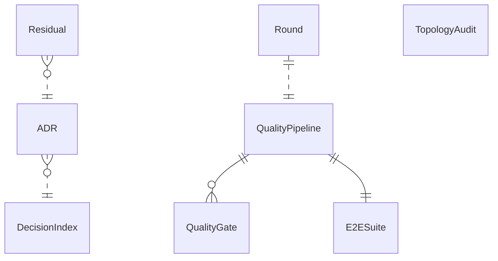

{/* Generated by `modelith render`. Do not edit by hand; edit the .modelith.yaml source and re-render. */}

# tellme — Quality Process

Models how tellme maintains its own quality: the ordered `QualityPipeline` of gates run by `make verify` (plus the E2E suite and the Gherkin/DSL topology audit), the ADR governance that records durable decisions, and the triage loop that homes a deferred item on a live issue or an ADR's Forward section. tellme's process is deliberately lighter than the reference's: it has **no** committed `NonFixCatalog`; it adopted a domain-model toolchain (a drift gate) in round 060 (**ADR 0030**) but **not** the reference's advisory code↔model gates; and it has **no coverage tooling** — the reference's `CoverageReport` has no tellme analogue (coverage tooling declined 2026-09-20, superseding the former R8a forwarding note), because the E2E contract executes the built binary as a subprocess (so E2E-verified paths read 0 % in a profile) and the AIxBDD gates (acceptance-coverage, dsl-exact-one-match, the E2E contract, the falsifiability witnesses, the layer/drift gates) are the stronger instruments.

## Glossary

- **`NonFixCatalog`** — The reference's curated catalog of accepted non-fixes (`docs/architect/INTENTIONAL_NON_FIXES.md`). tellme **deliberately has none** — a deferred item is homed on a **live issue** or an **ADR Forward section** instead, so it outlives a frozen plan package. This is a recorded divergence.
- **`QualityPipeline`** — The ordered set of gates a change must pass before a round is delivered. Its aggregate entry point is `make verify` (which includes `modelith-check`); the E2E contract runs under `make test` / `go test`; the topology audit is a carried check, not a `make verify` member.
- **`Residual`** — A deferred, non-blocking item discovered while delivering a round. It MUST be homed on a durable surface — a live issue or an ADR's Forward section — never left only in a frozen plan package.
- **`Round`** — One development iteration, carried by a plan package (`specs/plans/NNN-<slug>/`). A delivered round is frozen; a closeout marks it with an annotated `round-NNN` git tag on the `dev -> main` propagation merge.

## Enums

### `GateKind`

The category of a `QualityGate`, mirroring the Makefile sections.

| Value | Definition |
| --- | --- |
| `build` | Compilation / formatting (`build`, `fmt`, `tidy`). |
| `lint` | Static analysis (`vet`, `staticcheck`, `lint`). |
| `verify` | Convention/architecture guards (`verify-*`, `modelith-check`). |
| `security` | Dependency vulnerability scanning (`vulncheck`). |
| `test` | Execution gates (`test`, the E2E contract, `test-fast`). |

### `GatePolicy`

Whether a gate can fail the pipeline.

| Value | Definition |
| --- | --- |
| `zero-tolerance` | Any violation fails the gate (and thus the pipeline). |
| `advisory` | The gate reports but never fails the pipeline. |

## Entities

### `ADR`

An Architecture Decision Record under `docs/decisions/NNNN-*.md` — a numbered, indexed document capturing a durable decision and its rationale. An ADR may carry a **Forward** section holding the round's non-blocking residuals.

**Relationships**

- `DecisionIndex` — n:1 — referenced — Every ADR is listed in the index.

**Attributes**

| Name | Type | Description |
| --- | --- | --- |
| `number` | integer | The unique ADR number. |
| `path` | string | The file under `docs/decisions/`. |

**Invariants**

- **adr-index-consistent** — Every `ADR` under `docs/decisions/` is listed in the `DecisionIndex`, and no number is claimed twice.

### `DecisionIndex`

The `docs/decisions/README.md` index: the ordered list of `ADR`s with a one-line summary and a status. It is the discoverability surface for the project's durable decisions (human-curated, a plain table).

**Invariants**

- **decision-index-lists-all-adrs** — The `DecisionIndex` lists every `ADR` that exists on disk.

### `E2ESuite`

The executable acceptance contract: godog scenarios over `specs/truth/features/**`, run by `make test` / `go test -count=1 ./...`. Scenarios run in parallel by default (`Concurrency = 4`, with a `TELL_ME_E2E_CONCURRENCY` seam); the `test-fast` subset runs a slice of the contract behind a banner and is **never** the gate.

**Invariants**

- **e2e-subset-never-the-gate** — The `test-fast` subset is never the gate — `make test` always runs the full contract.
- **e2e-parallel-by-default** — The `E2ESuite` runs its scenarios in parallel by default.

### `QualityGate`

One check backed by a Makefile target — e.g. `verify-architecture` (the layer-discipline gate) or `modelith-check` (the domain-model drift gate). Each gate has a GateKind and a GatePolicy. Gates that shell a tool binary resolve it from PATH / GOPATH bin.

**Attributes**

| Name | Type | Description |
| --- | --- | --- |
| `name` | string | The Makefile target name. |
| `kind` | GateKind | The gate category. |
| `policy` | GatePolicy | Whether a violation fails the pipeline. |

**Invariants**

- **zero-tolerance-gate-fails** — A `zero-tolerance` `QualityGate` fails the pipeline on the first violation.
- **advisory-gate-never-blocks** — An `advisory` `QualityGate` never fails the pipeline.

### `QualityPipeline`

The ordered gates a change must pass. `make verify` aggregates `verify-no-test-sleep` + `verify-no-network` + `vet` + `verify-cross-compile` + `verify-mcp-sdk-confinement` + `verify-architecture` + `modelith-check` + `lint` + `vulncheck`; the E2E contract runs under `make test`. The pipeline stops at the first failing gate.

**Relationships**

- `QualityGate` — 1:n — owned
- `E2ESuite` — 1:1 — owned

**Invariants**

- **pipeline-stops-on-failure** — The `QualityPipeline` stops at the first failing `QualityGate`.

### `Residual`

A deferred, non-blocking item discovered while delivering a `Round`. It MUST be homed on a durable surface — a live issue or an `ADR` Forward section — because a frozen plan package is history that later rounds do not read.

**Relationships**

- `ADR` — n:1 — referenced — An ADR Forward section is a durable home for a residual.

**Invariants**

- **residual-homed-on-a-durable-surface** — A `Residual` is homed on a live issue or an `ADR` Forward section — never only in a frozen plan package.

### `Round`

One development iteration, carried by a plan package. A delivered round is frozen (`plan-package-frozen`); a closeout propagates `dev -> main` (a no-ff merge) and marks the delivered round with an annotated `round-NNN` git tag on the propagation merge commit.

**Relationships**

- `QualityPipeline` — 1:1 — referenced — A round must pass the pipeline before delivery.

**Invariants**

- **delivered-round-is-frozen** — A delivered `Round`'s plan package is frozen history; a new iteration starts a fresh package.
- **round-close-tag-on-propagation-merge** — A delivered `Round` is marked with an annotated `round-NNN` tag on the `dev -> main` propagation merge commit.

### `TopologyAudit`

The Gherkin/DSL topology script (from the aixbdd-tmg toolchain) that checks the truth-tree's feature/DSL structure. It is a **carried** check, not a `make verify` member; a small set of pre-existing DSL-matching errors is recorded rather than gated.

**Invariants**

- **topology-audit-not-a-gate** — The `TopologyAudit` is a carried check, not a `QualityPipeline` member.

## Relationships

## Invariants

- **triage-loop-closed** — Every deferred item is either fixed or homed durably — none are silently dropped.
- **no-nonfix-catalog** — tellme keeps no committed `NonFixCatalog` — the durable home is a live issue or an ADR Forward section (a recorded divergence).

## Scenarios

### A release gate run

Before delivering a round, the operator runs the pipeline. Every gate passes in order, the E2E contract is green, and the round proceeds.

**Actors:** QualityPipeline, QualityGate, E2ESuite, Round

**Steps**

1. The operator runs `make verify` (the aggregate gate).
2. Each `QualityGate` passes in order; the pipeline does not stop.
3. `make test` runs the full `E2ESuite` contract green.
4. The round is cleared for delivery.

**Invariants touched**

- **pipeline-stops-on-failure** — The `QualityPipeline` stops at the first failing `QualityGate`.
- **zero-tolerance-gate-fails** — A `zero-tolerance` `QualityGate` fails the pipeline on the first violation.

### A gate failure stops the pipeline

A change introduces a layer violation. The layer-discipline gate fails and the pipeline stops; later gates never run until it is fixed.

**Actors:** QualityPipeline, QualityGate

**Steps**

1. A change adds an illegal cross-layer import.
2. `verify-architecture` (zero-tolerance) fails and names the offending edge.
3. The `QualityPipeline` stops at the failing gate.
4. The violation is fixed; the re-run passes.

**Invariants touched**

- **pipeline-stops-on-failure** — The `QualityPipeline` stops at the first failing `QualityGate`.
- **zero-tolerance-gate-fails** — A `zero-tolerance` `QualityGate` fails the pipeline on the first violation.

### A residual is homed durably

A non-blocking residual surfaces during a round. It is recorded on a live issue or an ADR Forward section, so it survives the round's package freeze.

**Actors:** Residual, ADR, Round

**Steps**

1. A delivery review surfaces a non-blocking residual.
2. The `Residual` is homed on a live issue or the round's `ADR` Forward section.
3. The round's plan package freezes without carrying the residual alone.

**Invariants touched**

- **residual-homed-on-a-durable-surface** — A `Residual` is homed on a live issue or an `ADR` Forward section — never only in a frozen plan package.
- **delivered-round-is-frozen** — A delivered `Round`'s plan package is frozen history; a new iteration starts a fresh package.

### The topology audit is carried

The Gherkin/DSL topology script runs as a carried check; its pre-existing findings are recorded, not gated.

**Actors:** TopologyAudit, QualityPipeline

**Steps**

1. The operator runs the topology audit.
2. Its pre-existing DSL-matching findings are recorded, not gated.

**Invariants touched**

- **topology-audit-not-a-gate** — The `TopologyAudit` is a carried check, not a `QualityPipeline` member.

### An ADR is recorded and indexed

A durable decision is written as an ADR and added to the index; the number is unique.

**Actors:** ADR, DecisionIndex

**Steps**

1. The operator writes a new `ADR` under `docs/decisions/`.
2. The ADR is added to the `DecisionIndex`.
3. No ADR number is claimed twice.

**Invariants touched**

- **adr-index-consistent** — Every `ADR` under `docs/decisions/` is listed in the `DecisionIndex`, and no number is claimed twice.
- **decision-index-lists-all-adrs** — The `DecisionIndex` lists every `ADR` that exists on disk.

