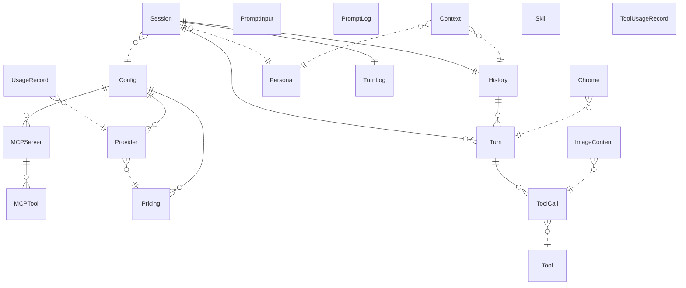

{/* Generated by `modelith render`. Do not edit by hand; edit the .modelith.yaml source and re-render. */}

# tellme — Multi-Provider Reasoning Agent (POSIX CLI)

A disciplined, POSIX/bash-only re-creation of tell-me-go. A CLI that turns a prompt into a multi-round reasoning turn: it assembles a provider payload (persona + recent history + the prompt), drives a bounded think→act→observe loop against a multi-provider `Provider` (the two families tellme drives — OpenAI-compatible and Gemini), executes agent `Tool`s, streams a diagnostic `Chrome`, and persists the session. Three operator-declared directions shape it: **no security layer**, **no Windows**, and **bash-first** — hence a deliberately small tool surface. Skills reach the model on demand (no automatic injection).

## Glossary

- **`Chrome`** — The diagnostic surface written to `stderr` on a turn: the turn rule/header, the payload status lines, the `[Tool …]` lines, the `[Tool Output]` block, the spinner, and the Ready summary. Terminal-gated accents are colour; the rest is plain text. Distinct from the answer, which is the rendered Markdown on `stdout`.
- **`NoSecurityLayer`** — A settled exclusion, not an omission: tellme ships **no** SafePath authorization, consent prompt, command whitelist, or path boundary. Tools read, write, and execute whatever they are given; the resulting risk is an explicitly accepted operator decision. The reference's SecurityManager / UserInteractor are therefore **absent** from this model.
- **`Orchestrator`** — The turn driver: it assembles the `Context`, calls the selected `Provider`, dispatches `ToolCall`s in a bounded loop, renders the `Chrome`, and persists the `Turn`. In the code it is `internal/agent`'s loop, reached through the injected domain port `agentport.Loop` (ADR 0019), so the CLI names no `internal/agent` identifier.
- **`Persona`** — The agent identity for a session — a MODE (e.g. `butler`) plus a PERSON system prompt, read from the `Config`. `TELL_ME_MODE` selects the mode for the offline session commands. The in-group peer agents (`pm`, `rd`, `architect`, `coder`, `griller`) are sibling personas of the same manager.
- **`TellMeHome`** — The filesystem root for all tellme state — `$TELL_ME_HOME` — holding the `docs/skills/` catalog, the per-mode `output/<mode>/` workspaces (history, turns log, usage log), and configs. Managed by the external Niffler script (see the environment-management model); tellme treats it as the stable namespace for everything it persists. Two artifacts live **outside** it, in the user-global `~/.tellme/` root: the shared prompt log and the tool-usage log.

## Enums

### `PayloadStatusKind`

The two payload figures the `Chrome` reports per `Turn`.

| Value | Definition |
| --- | --- |
| `estimated` | The pre-flight estimate, rendered as a signed increment plus the estimate (`+<delta> ~<n> tokens`), computed before the provider call. |
| `measured` | The post-turn measured count, from the provider's usage report. |

### `ProviderFamily`

The wire-protocol family backing a `Provider` — the compile-time-safe dispatch dimension, distinct from the user-facing provider label (which may name an OpenAI-compatible vendor). tellme drives exactly two families; a label resolving to any other family (for example `anthropic`) is refused with the frozen provider-error phrase and never reaches a transport.

| Value | Definition |
| --- | --- |
| `openai` | OpenAI-compatible (covers openai, deepseek, kimi, and any OpenAI-protocol vendor). |
| `gemini` | Google Gemini / Vertex AI (covers the google and gemini labels). |

### `ToolGate`

The capability gate on a `Tool`'s availability (round 062; ADR 0032). A `vision` tool (`read_image`) is offered only to a `Provider` that declares `vision`; `none` is offered to every provider.

| Value | Definition |
| --- | --- |
| `none` | Always offered (the readers — incl. `search_files` — the write pair, `execute_command`, `list_skills`). |
| `vision` | Offered only when the selected `Provider` declares `vision`. |

### `ToolOutcome`

The recorded fate of one executed `ToolCall`.

| Value | Definition |
| --- | --- |
| `ok` | The tool ran; the result is kept (including a bounded/truncated result). |
| `error` | The tool returned a non-nil error. |
| `timeout` | The per-call deadline expired; the tool returned a nil-error "stopped" result. |

## Entities

### `Chrome`

The diagnostic surface on `stderr`: the turn rule and header, the payload status lines (`estimated` + `measured`), the `[Tool Reason]` / `[Tool Action]` / `[Tool Result]` / `[Tool Warning]` lines, the live `[Tool Output]` block, the turn spinner, and the Ready summary. Colour accents are **terminal-gated** (a terminal `stderr` with `-r` off) and never enter `stdout` or the `TurnLog`; the `[Tool …]` values are control-free and bounded; the answer (`stdout`) is separately rendered Markdown.

**Relationships**

- `Turn` — n:1 — referenced

**Attributes**

| Name | Type | Description |
| --- | --- | --- |
| `colour` | boolean | Whether terminal-gated accents are on. |
| `payloadFigure` | PayloadStatusKind | The kind of the last payload figure the chrome reported. |

**Invariants**

- **chrome-colour-terminal-gated** — The turn chrome's colour appears only on a terminal `stderr` with `-r` off — never in `turns.log`. (The offline `-l` listing's role-header accent is a separate surface, gated on a terminal `stdout` with `-r` off — round 073; the accent's unit is the WHOLE label incl. the backward turn index, `[USER] - N` / `[MODEL] - N` — round 082.)
- **chrome-tool-values-control-free** — Every `[Tool …]` value is folded, control-free, and rune-capped.
- **chrome-spinner-sample-cadence** — The spinner's braille frame stays on its fast cadence while its resource figures refresh at most once per second.

### `Config`

The YAML configuration loaded at startup (the `-c` path, else the default). It carries the `Persona` (MODE/PERSON), the `Provider` registry plus `SELECTED_PROVIDER`, per-model `Pricing`/context-window overrides, the `USE_TUI_PROMPT` toggle, the session limits (`MAX_TOOL_LOOP`, `MAX_HISTORY_TOKENS`, `WRAP_WIDTH` — the tool-resource budget derives from `MAX_HISTORY_TOKENS`), and the `MCPServer` declarations. `${VAR}` placeholders are expanded at load. It carries **no** security/consent keys — the no-security-layer direction.

**Relationships**

- `Provider` — 1:n — owned — The provider registry (YAML PROVIDERS).
- `Pricing` — 1:n — owned — Per-model overrides (YAML MODELS).
- `MCPServer` — 1:n — owned — Configured external MCP servers (YAML `MCP_SERVERS`).

**Attributes**

| Name | Type | Description |
| --- | --- | --- |
| `mode` | string | The persona identity (YAML MODE). |
| `selectedProvider` | string | Registry key of the active `Provider`. |
| `maxToolLoop` | integer | Bound on tool rounds within one `Turn` (YAML `MAX_TOOL_LOOP`). |
| `maxHistoryTokens` | integer | Token budget for the retained `Context`. |

**Invariants**

- **config-selected-provider-resolves** — `selectedProvider` MUST reference a key in the `Provider` registry.
- **config-no-security-keys** — `Config` carries no security/consent keys — there is no authorization surface.

### `Context`

The provider payload assembled before each `Turn`: the `Persona` system prompt, the recent `History`, and the current prompt. Its size is reported by the `Chrome` as an estimate before the call and a measurement after it, against the effective budget. (No `Skill` content enters the `Context` — skills are on-demand only.)

**Relationships**

- `Persona` — n:1 — referenced
- `History` — n:1 — referenced

**Invariants**

- **context-figures-reported** — The `Context`'s size is reported twice per turn — an `estimated` pre-flight figure and a `measured` post-turn figure.

### `History`

The persisted record of a session's completed `Turn`s — an append-only JSON-Lines file `history.jsonl` under `output/<mode>/`, plus an archive (`history.archive.jsonl`). One line per completed turn; a resumed session replays the stored steps (and their `signature`s) into the conversation. A rollback removes the last N complete turns (round 081 / ADR 0053).

**Relationships**

- `Turn` — 1:n — owned

**Attributes**

| Name | Type | Description |
| --- | --- | --- |
| `line` | object | A turn line `{prompt, answer, steps[], calls}`. |

**Invariants**

- **history-append-after-complete** — A `Turn` is persisted only after it completes (append-only). An operator-interrupted turn (round 079 / ADR 0051) with **≥ 1** completed tool step **is completed** by a synthetic closing answer (`history.InterruptedTurnAnswer`) and persisted; a turn interrupted with **zero** completed steps is **not** persisted. **Round 080 (ADR 0052):** the same exception extends to a **failed** turn — a turn that fails (a provider failure, or the tool-loop failure) after **≥ 1** completed tool step **is completed** by a class-specific synthetic answer (`history.ProviderFailedTurnAnswer` / `history.ToolFailedTurnAnswer`) and persisted, while the failure surface (frozen phrase + exit code) is reported unchanged; a failure with **zero** completed steps is **not** persisted. A *completed tool step* is a step whose tool **returned** a result (a success, or a nil-error kill/timeout result) — not necessarily a successful one.
- **history-rollback-removes-complete-turns** — A rollback (round 081 / ADR 0053) removes the last N **complete** `history.Entry` lines — the operator prompt, the provider answer, and **every** recorded tool `step` of each removed turn, atomically (a turn is never split) — and MUST leave the surviving entries byte-unchanged; it is **durable** (temp-file + fsync + atomic rename, so a crash mid-rollback leaves the prior history intact), **clamps** N to the available turns, and MUST NOT touch the archive (`history.archive.jsonl`). The `history.Entry` / `history.Step` JSON shapes are unchanged.

### `ImageContent`

A piece of non-text media (an image) a `Tool` (`read_image`) returns **in-band** from its execution — the shipped type is `tools.MediaPart` (round 070 / ADR 0040). A media-producing tool implements the optional MediaTool capability, so a `read_image` call runs via ExecuteMedia, returning the text result **and** the media; the loop folds a round's media onto **one** `user` message, after **all** the round's `tool` results (round 083 / ADR 0055 — round-scoped placement, so the round's `tool` results stay contiguous on the wire). The former per-call `context` collector (WithMediaCollector/AttachMedia, ADR 0032 D7a) is **retired** — the tool no longer reaches into the conversation model to name its own result type. Its kind is resolved from the file's **content** (magic bytes: JPEG/PNG/GIF/WebP), never the name; it is serialized inline on **both** families — a base64 `image_url` block on the OpenAI-compatible wire, or a base64 `inlineData` blob on the Gemini/Vertex wire (round 063 / ADR 0033) — riding **one** `user` message after **all** the round's `tool` results (round 083 / ADR 0055). The media is in-flight only: it is never persisted with the `Turn` (the history step stores the tool's text result).

**Relationships**

- `ToolCall` — n:1 — referenced — The tool call that produced (attached) the image.

**Attributes**

| Name | Type | Description |
| --- | --- | --- |
| `mimeType` | string | The media type resolved from the file's content (a magic-byte sniff). |
| `data` | object | The image bytes, attached inline (never truncated). |

**Invariants**

- **image-kind-sniffed-from-content** — An `ImageContent`'s kind is resolved from the file's content (magic bytes), never the file name nor a declared MIME.
- **image-inline-limit** — An image larger than the selected provider's family-aware inline ceiling is a loud refusal — never truncated and never partially sent; the OpenAI-compatible family allows 32 MiB, the Gemini/Vertex family 14 MiB (round 063).
- **image-never-silently-dropped** — An image is carried on either family or the turn fails loudly; it is never silently lost.

### `MCPServer`

An external MCP server declared under `MCP_SERVERS` — only a **remote** server (a URL entry) is supported; a COMMAND (local stdio) entry is warned about and skipped. Its tools are offered to the model with tellme's own `{reason, MCP_PAYLOAD}` envelope. The server still receives its own arguments, but the declaration the **model** is offered is filtered so a strict provider cannot reject the whole request: a family-agnostic floor drops vendor extensions (`x-…`, `$schema`), and for a closed-wire family (Vertex/Gemini) the declaration is projected onto the provider's supported schema surface (default-deny) before it reaches the wire.

**Relationships**

- `MCPTool` — 1:n — owned — Tools discovered from this server.

**Attributes**

| Name | Type | Description |
| --- | --- | --- |
| `name` | string | The unique server key. |
| `transport` | string | Only a URL entry (remote) is supported; a COMMAND (local stdio) entry is warn+skipped. |

**Invariants**

- **mcp-server-definition-preserved** — The `MCPServer` still receives its own arguments — only the declaration **offered to the model** is filtered before the provider wire (vendor extensions dropped for every family; a closed-wire family receives only keywords its schema reader accepts).
- **tool-declaration-fits-the-provider-wire** — A declaration offered to a closed-wire provider carries only keywords its schema reader accepts; tellme drops an unsupported keyword or a wrong-kind value rather than coerce it, and fails closed to the freeform object.
- **mcp-token-never-logged** — MCP credentials/headers MUST never be logged.

### `MCPTool`

A tool discovered from an `MCPServer`. The model must call it as tellme's own envelope `{reason, MCP_PAYLOAD}`; only `MCP_PAYLOAD` is forwarded to the server, and a call that is not a valid envelope is refused before the server is contacted.

**Invariants**

- **mcp-call-is-an-envelope** — An MCP call MUST be a `{reason, MCP_PAYLOAD}` envelope; a non-envelope call is refused.
- **mcp-payload-forwarded-alone** — Only `MCP_PAYLOAD` reaches the server.

### `Persona`

The agent's identity for a session — a MODE and a PERSON system prompt. It is injected as the system message on every turn. The offline commands select a persona by mode.

**Attributes**

| Name | Type | Description |
| --- | --- | --- |
| `mode` | string | The persona identity. |
| `person` | string | The system prompt. |

**Invariants**

- **persona-injected-every-turn** — A session's `Persona` is injected as the system message on every turn.

### `Pricing`

The per-model cost + context-window table. It maps a model id to a context window and the per-million-token rates; the effective token budget for a session derives from the configured `MAX_HISTORY_TOKENS` and the active model's window.

**Attributes**

| Name | Type | Description |
| --- | --- | --- |
| `modelName` | string | The model id this row applies to. |
| `contextWindow` | integer | Maximum token capacity for the model. |

**Invariants**

- **pricing-unique-model** — Each `modelName` appears at most once in the pricing table.

### `PromptInput`

The operator's input surface: the positional argument(s) and/or piped stdin (bounded 1 MiB), the plain multi-line terminal reader, and the opt-in interactive TUI prompt (`-i`) with a debounced suggestion engine. It is a behavioural role, not persisted state.

**Attributes**

| Name | Type | Description |
| --- | --- | --- |
| `interactive` | boolean | Whether the opt-in TUI prompt is engaged. |

**Invariants**

- **prompt-input-interactive-needs-a-terminal** — The interactive prompt engages only when `-i` is set AND stdin is a terminal.

### `PromptLog`

The shared, user-global prompt log at `~/.tellme/global_prompts.jsonl` — one `{timestamp, prompt}` JSON line per entered prompt. It seeds the `-i` suggestion engine (read newest-first, deduped); it is written only under `-i`, and seeded once from the environment-scoped file when absent.

**Invariants**

- **prompt-log-written-only-interactively** — The shared prompt log is written only under the `-i` prompt.

### `Provider`

An LLM backend reachable via one ProviderFamily. It carries a model id, a base URL, authentication, and optional thinking settings; one is selected per session from the `Config` registry. tellme speaks the two families through thin transports; a vendor is just a label mapping to a family.

**Relationships**

- `Pricing` — n:1 — referenced — The per-model pricing/window the `Provider`'s model resolves to.

**Attributes**

| Name | Type | Description |
| --- | --- | --- |
| `label` | string | The free-form provider label (e.g. `deepseek`, `kimi`). |
| `family` | ProviderFamily | _Derived:_ Resolved from the label. |
| `model` | string | The model identifier sent on the wire. |
| `vision` | boolean | Whether this provider accepts image input (YAML `VISION`, default false; round 062 / ADR 0032). Declared, never inferred from the model name or the family; when false the `read_image` `Tool` is not offered. Round 063 / ADR 0033: the single `VISION` key is honoured by **both** families — the OpenAI-compatible `image_url` block and the Gemini/Vertex `inlineData` blob. |

**Invariants**

- **provider-label-resolves-to-one-family** — Every provider label MUST resolve to exactly one ProviderFamily.
- **provider-family-must-be-drivable** — A label resolving to a family tellme cannot drive (e.g. `anthropic`) is refused with the frozen provider-error phrase — tellme drives only the `openai` and `gemini` families.

### `Session`

One conversation under a per-mode workspace. It owns the `History`, the `TurnLog`, and the `UsageRecord` stream, all under the `TellMeHome` (`$TELL_ME_HOME`) subtree `output/<mode>/`; `--new` archives them and starts fresh. The offline readers (`-l`, `-t`, `--tool-usage`, prompt-less `--new`) resolve the mode as `TELL_ME_MODE` → the `-c` config's MODE → the default config's MODE → `butler`, and stay offline. `-l` additionally resolves the rendered width (`WRAP_WIDTH`/`TELL_ME_WRAP_WIDTH`) **best-effort** — a width that cannot be resolved degrades to the renderer default rather than failing the listing (round 073). A standalone `-b`/`--back [N]` (round 081 / ADR 0053) rolls back the last N turns of the `History` offline and exits (`tellme -b [N] "prompt"` rolls back **then** runs the prompt).

**Relationships**

- `Turn` — 1:n — owned
- `History` — 1:1 — owned — Persisted record of this session's completed turns.
- `TurnLog` — 1:1 — owned — The per-session rendered-chrome text file (`turns.log`).
- `Persona` — n:1 — referenced — The persona the session runs under.
- `Config` — n:1 — referenced

**Attributes**

| Name | Type | Description |
| --- | --- | --- |
| `mode` | string | The persona identity this session runs under. |

**Invariants**

- **session-mode-resolves-deterministically** — A session's mode resolves by the fixed precedence `TELL_ME_MODE` → the `-c` config's MODE → the default config's MODE → `butler`.
- **session-offline-reads-stay-offline** — The offline readers (`-l`, `-t`, `--tool-usage`, prompt-less `--new`) make no provider request.
- **session-rollback-stays-offline** — A standalone `-b`/`--back [N]` (no positional prompt, round 081 / ADR 0053) rolls back the session's `History` without any provider request; a prompt-bearing `-b [N] "prompt"` rolls back first, then runs the prompt as a normal reasoning turn.

### `Skill`

A guidance block (a SKILL.md file) under the `$TELL_ME_HOME/docs/skills/` catalog. The surface is **on-demand only** (round 033 Q1) — a recorded divergence from the reference: tellme performs **no** automatic relevance-based injection into the `Context`. The model discovers the catalog with the `list_skills` tool (name + description + location, path-sorted) and reads a chosen skill's file with the existing `read_files` tool. Skills are authored as the BDD workflow's executable SOPs.

**Attributes**

| Name | Type | Description |
| --- | --- | --- |
| `name` | string | The unique skill identifier (frontmatter `name`). |
| `description` | string | Human-readable summary (frontmatter `description`). |
| `location` | string | The on-disk path the agent opens with `read_files`. |

**Invariants**

- **skill-unique-name** — A `Skill`'s name is unique across the catalog; the loader resolves a duplicate by keeping the first discovered and dropping the later one silently (no error).
- **skill-on-demand-only** — A `Skill` reaches the model only on demand (`list_skills` + `read_files`); tellme performs no automatic relevance-based injection into the `Context`.

### `Tool`

A capability the model may invoke, advertised with a JSON argument schema. The surface is deliberately small: the reader family (`list_files`, `read_files`, `get_tree`, and the in-file content search `search_files` — round 071 / ADR 0043), the write pair (`write_file`, `replace_text`), `execute_command` (`bash -c`), and `list_skills`. When the selected `Provider` declares `vision`, one more tool is offered — `read_image`, which reads a local image and returns it **in-band** as an `ImageContent` (the shipped `tools.MediaPart` type; round 070 / ADR 0040) through the optional MediaTool capability. Every tool is bounded by the resource contract (`max_output_tokens` / `timeout` — default + param + ceiling) and requires a `reason`. There is no consent gate and no path boundary.

**Attributes**

| Name | Type | Description |
| --- | --- | --- |
| `name` | string | The unique wire tool name. |
| `requiresReason` | boolean | Always true — every tool call must carry a reason. |
| `gate` | ToolGate | The capability gate (round 062 / ADR 0032): `vision` for `read_image` (offered only when the selected `Provider` declares `vision`), `none` otherwise — the readers (`list_files`, `read_files`, `get_tree`, `search_files`), the write pair, `execute_command`, and `list_skills` are always offered. |

**Invariants**

- **tool-name-unique** — Each `Tool` has a unique name.
- **tool-result-bounded** — Every tool bounds its own output at the source; the loop clamp is the backstop.
- **tool-offered-only-when-capable** — `read_image` (its `gate` is `vision`) is offered to the model only when the selected `Provider` declares `vision`; the offered set is a function of the selected provider's capability.

### `ToolCall`

One `Tool` invocation requested by the model during a `Turn`: the tool name, its arguments, its result, its ToolOutcome, and (when the provider emits one) its `signature`. Every tool call MUST carry a `reason` — the universal *no reason, no go* gate refuses a call whose reason does not render, folding a recoverable result back to the model.

**Relationships**

- `Tool` — n:1 — referenced — The tool the call resolves to in the registry.

**Attributes**

| Name | Type | Description |
| --- | --- | --- |
| `tool` | string | The wire tool name. |
| `reason` | string | The model-authored justification; required by the universal gate. |
| `outcome` | ToolOutcome | The recorded fate of the call. |

**Invariants**

- **call-requires-a-reason** — A tool call MUST carry a renderable `reason`; a reason-less call is refused (it never executes).
- **call-outcome-classified-structurally** — `outcome` is classified from the tool error and the loop-owned per-call deadline — never by sniffing the result text.

### `ToolUsageRecord`

One line per **executed** `ToolCall` in the user-global `~/.tellme/tools-count.jsonl`: `{timestamp, tool, outcome}`. It is global (never reset by `--new`) and read by the `--tool-usage` flag, which prints per-registry-tool invocation counts.

**Invariants**

- **tool-usage-global-and-best-effort** — The tool-usage log is global and best-effort — a write failure never breaks a turn.

### `Turn`

One atomic exchange: the prompt, zero or more provider rounds (interleaved with `ToolCall` execution), and a final answer. A turn is bounded by `MAX_TOOL_LOOP` tool rounds. On completion it is persisted as a single `history.jsonl` line `{prompt, answer, steps[], calls}` — the provider's answer text verbatim (content, not the rendered form). Each executed step records its provider `signature` when the provider emits one, so a resumed session replays faithfully.

**Relationships**

- `ToolCall` — 1:n — owned
- `Session` — n:1 — referenced

**Attributes**

| Name | Type | Description |
| --- | --- | --- |
| `prompt` | string | The user's input text. |
| `answer` | string | The provider's final answer text (verbatim). |
| `callCount` | integer | The number of AI-endpoint calls this turn made (stored as `calls`). |

**Invariants**

- **turn-bounded-by-tool-loop** — The tool rounds within one `Turn` MUST NOT exceed `Config.maxToolLoop`.
- **turn-answer-stored-verbatim** — A `Turn`'s persisted `answer` is the provider's content, never the rendered form — **except** a partial turn: an operator-interrupted turn (round 079 / ADR 0051) whose persisted `answer` is the synthetic `history.InterruptedTurnAnswer`, or a **failed** turn with completed steps (round 080 / ADR 0052) whose persisted `answer` is the class-specific synthetic `history.ProviderFailedTurnAnswer` / `history.ToolFailedTurnAnswer`.

### `TurnLog`

The per-session plain-text file `output/<mode>/turns.log`: the subset of the rendered `Chrome` routed through the sink (the turn rule/header, the payload status lines, the grouped `[Tool Reason]` lines, the metrics line, and the Ready summary). It is written best-effort and read by the `-t` flag; the input-capture ack, prompt echo, errors, spinner, and the `[Tool Output]` block are not persisted.

**Invariants**

- **turns-log-content-equal-but-plain** — `turns.log` follows the chrome's content but carries no colour.

### `UsageRecord`

One record per provider call in the per-mode `tokens.log`: the token breakdown and the cost. The Ready summary sums them into the session token totals and cost. The cached (hit) and reasoning (thinking) counts are **provider-reported** and **family-decoded** from the response's usage block (round 072 / ADR 0044): the Gemini/Vertex family reads `cachedContentTokenCount`/`thoughtsTokenCount` (disjoint from its candidates count), the OpenAI-compatible family reads `prompt_tokens_details.cached_tokens`/`completion_tokens_details.reasoning_tokens` (its completion count is the exclusive `completion − reasoning`).

**Relationships**

- `Provider` — n:1 — referenced

**Invariants**

- **usage-summed-for-the-ready-summary** — The Ready summary's session totals are the sum of the session's `UsageRecord`s.

## Relationships

## Invariants

- **no-security-layer** — `NoSecurityLayer` — tellme has no authorization/consent surface; tools act on whatever they are given (an accepted operator decision).
- **posix-bash-only** — tellme targets bash on POSIX only — no Windows variant.
- **deterministic-and-hermetic** — Behaviour is deterministic; `make verify` is hermetic (ADR 0012).

## Scenarios

### A prompt turn

The user runs tellme with a prompt. The `Orchestrator` assembles the `Context`, shows the estimated payload line, calls the selected `Provider`, renders the answer, reports the measured payload + the Ready summary, and persists the `Turn`.

**Actors:** Orchestrator, Config, Provider, Context, Chrome, Session, Turn

**Steps**

1. The user passes a prompt as an argument (and/or piped stdin).
2. `Orchestrator` resolves the `Persona` and the `Provider` from the `Config`.
3. `Orchestrator` assembles the `Context` and emits the `estimated` payload line.
4. `Provider` returns the answer (a text Thought).
5. The answer is rendered to `stdout`; the `Chrome` emits the `measured` line + the Ready summary.
6. `Orchestrator` persists the `Turn` to the `History` and records a `UsageRecord`.

**Invariants touched**

- **turn-answer-stored-verbatim** — A `Turn`'s persisted `answer` is the provider's content, never the rendered form — **except** a partial turn: an operator-interrupted turn (round 079 / ADR 0051) whose persisted `answer` is the synthetic `history.InterruptedTurnAnswer`, or a **failed** turn with completed steps (round 080 / ADR 0052) whose persisted `answer` is the class-specific synthetic `history.ProviderFailedTurnAnswer` / `history.ToolFailedTurnAnswer`.
- **history-append-after-complete** — A `Turn` is persisted only after it completes (append-only). An operator-interrupted turn (round 079 / ADR 0051) with **≥ 1** completed tool step **is completed** by a synthetic closing answer (`history.InterruptedTurnAnswer`) and persisted; a turn interrupted with **zero** completed steps is **not** persisted. **Round 080 (ADR 0052):** the same exception extends to a **failed** turn — a turn that fails (a provider failure, or the tool-loop failure) after **≥ 1** completed tool step **is completed** by a class-specific synthetic answer (`history.ProviderFailedTurnAnswer` / `history.ToolFailedTurnAnswer`) and persisted, while the failure surface (frozen phrase + exit code) is reported unchanged; a failure with **zero** completed steps is **not** persisted. A *completed tool step* is a step whose tool **returned** a result (a success, or a nil-error kill/timeout result) — not necessarily a successful one.
- **context-figures-reported** — The `Context`'s size is reported twice per turn — an `estimated` pre-flight figure and a `measured` post-turn figure.

### A tool-using turn

The model requests `execute_command`. Because the tool carries a `reason`, the loop runs it, streams the `[Tool Output]` block (grey on a terminal), folds the result back, and repeats until the final answer.

**Actors:** Orchestrator, Tool, ToolCall, Chrome, Session

**Steps**

1. `Provider` returns a tool call to `execute_command` carrying a `reason`.
2. The universal gate accepts the call (the reason renders).
3. The tool runs through `bash -c`, bounded by the resource contract.
4. The `Chrome` streams the `[Tool Output]` block to `stderr`.
5. The result is folded back; the loop repeats until a final answer.

**Invariants touched**

- **call-requires-a-reason** — A tool call MUST carry a renderable `reason`; a reason-less call is refused (it never executes).
- **tool-result-bounded** — Every tool bounds its own output at the source; the loop clamp is the backstop.
- **chrome-tool-values-control-free** — Every `[Tool …]` value is folded, control-free, and rune-capped.

### A reason-less call is refused

The model requests a tool without a renderable reason. The universal gate (single-owned by the round-046 renderer) refuses the call — the tool does not execute — and folds a recoverable result asking the model to retry.

**Actors:** Orchestrator, ToolCall

**Steps**

1. `Provider` returns a tool call with no renderable `reason`.
2. The gate refuses the call; the tool does not execute.
3. A recoverable `tool`-role result asking for a `reason` is folded back.

**Invariants touched**

- **call-requires-a-reason** — A tool call MUST carry a renderable `reason`; a reason-less call is refused (it never executes).

### Resuming a session

A later process reads `history.jsonl` and replays the stored turns, including each step's provider `signature`, so a tool-using session resumes faithfully.

**Actors:** Session, History, Turn, Context

**Steps**

1. A new process loads the session's `History`.
2. The stored `Turn`s (with their steps + signatures) are replayed into the `Context`.
3. The next `Turn` proceeds against the resumed conversation.

**Invariants touched**

- **history-append-after-complete** — A `Turn` is persisted only after it completes (append-only). An operator-interrupted turn (round 079 / ADR 0051) with **≥ 1** completed tool step **is completed** by a synthetic closing answer (`history.InterruptedTurnAnswer`) and persisted; a turn interrupted with **zero** completed steps is **not** persisted. **Round 080 (ADR 0052):** the same exception extends to a **failed** turn — a turn that fails (a provider failure, or the tool-loop failure) after **≥ 1** completed tool step **is completed** by a class-specific synthetic answer (`history.ProviderFailedTurnAnswer` / `history.ToolFailedTurnAnswer`) and persisted, while the failure surface (frozen phrase + exit code) is reported unchanged; a failure with **zero** completed steps is **not** persisted. A *completed tool step* is a step whose tool **returned** a result (a success, or a nil-error kill/timeout result) — not necessarily a successful one.

### An MCP tool call

The model calls an MCP-backed tool. It must be tellme's own `{reason, MCP_PAYLOAD}` envelope; only the payload reaches the server.

**Actors:** MCPServer, MCPTool, ToolCall, Orchestrator

**Steps**

1. `Provider` returns a call to an `MCPTool`.
2. The call is checked to be a `{reason, MCP_PAYLOAD}` envelope.
3. Only `MCP_PAYLOAD` is forwarded to the `MCPServer`.

**Invariants touched**

- **mcp-call-is-an-envelope** — An MCP call MUST be a `{reason, MCP_PAYLOAD}` envelope; a non-envelope call is refused.
- **mcp-payload-forwarded-alone** — Only `MCP_PAYLOAD` reaches the server.
- **mcp-server-definition-preserved** — The `MCPServer` still receives its own arguments — only the declaration **offered to the model** is filtered before the provider wire (vendor extensions dropped for every family; a closed-wire family receives only keywords its schema reader accepts).

### A schema a strict provider cannot parse

A remote server annotates an argument with a vendor extension. tellme's family-agnostic floor drops the annotation, and a closed-wire transport projects the declaration onto the supported surface, so the turn reaches the model instead of failing with a whole-request rejection.

**Actors:** MCPServer, MCPTool, Tool, Orchestrator

**Steps**

1. An `MCPServer` advertises a tool whose argument carries a vendor-extension keyword (`x-…`).
2. The floor drops the extension for every family.
3. For a closed-wire family, the declaration is projected onto the provider's supported surface (default-deny).
4. The turn reaches the model; the server still receives its own arguments.

**Invariants touched**

- **mcp-server-definition-preserved** — The `MCPServer` still receives its own arguments — only the declaration **offered to the model** is filtered before the provider wire (vendor extensions dropped for every family; a closed-wire family receives only keywords its schema reader accepts).
- **tool-declaration-fits-the-provider-wire** — A declaration offered to a closed-wire provider carries only keywords its schema reader accepts; tellme drops an unsupported keyword or a wrong-kind value rather than coerce it, and fails closed to the freeform object.

### Reading a local image

With a `Provider` that declares `vision`, the model calls `read_image`. The tool resolves the file's kind from its content and returns the media **in-band** from its execution (the MediaTool/ExecuteMedia capability; round 070 / ADR 0040); the loop folds the round's media back on **one** `user` message after **all** the round's `tool` results (round 083 / ADR 0055) — so the model can see the picture. The media is carried on the selected family's wire: an inline base64 `image_url` block on the OpenAI-compatible family, or an inline base64 `inlineData` blob on the Gemini/Vertex family (round 063 / ADR 0033). A provider without `vision` is not offered the tool; an oversize (past the family-aware ceiling) or non-picture file is a loud refusal.

**Actors:** Orchestrator, Tool, ToolCall, ImageContent, Provider

**Steps**

1. `Provider` returns a call to `read_image` carrying a `reason`.
2. The tool reads the file and resolves its kind from the content (magic bytes), and enforces the selected provider's family-aware inline ceiling.
3. The tool returns the `ImageContent` **in-band** (via ExecuteMedia); the loop folds the round's media onto **one** `user` message after **all** the round's `tool` results (round 083 / ADR 0055 — round-scoped).
4. The adapter serializes the image on the family's wire (`image_url` / `inlineData`); the `Provider` sees it and the turn completes.

**Invariants touched**

- **tool-offered-only-when-capable** — `read_image` (its `gate` is `vision`) is offered to the model only when the selected `Provider` declares `vision`; the offered set is a function of the selected provider's capability.
- **image-kind-sniffed-from-content** — An `ImageContent`'s kind is resolved from the file's content (magic bytes), never the file name nor a declared MIME.
- **image-inline-limit** — An image larger than the selected provider's family-aware inline ceiling is a loud refusal — never truncated and never partially sent; the OpenAI-compatible family allows 32 MiB, the Gemini/Vertex family 14 MiB (round 063).
- **image-never-silently-dropped** — An image is carried on either family or the turn fails loudly; it is never silently lost.

### Listing and using skills

The model needs the project's SOP. It enumerates the catalog with the `list_skills` tool, then opens a chosen skill with `read_files`. tellme performs no automatic injection — a `Skill` reaches the model on demand only.

**Actors:** Skill, Tool, Orchestrator

**Steps**

1. The model calls the `list_skills` `Tool`, which returns each `Skill`'s name, description, and location (path-sorted).
2. The model reads the chosen `Skill`'s file with `read_files`.

**Invariants touched**

- **skill-unique-name** — A `Skill`'s name is unique across the catalog; the loader resolves a duplicate by keeping the first discovered and dropping the later one silently (no error).
- **skill-on-demand-only** — A `Skill` reaches the model only on demand (`list_skills` + `read_files`); tellme performs no automatic relevance-based injection into the `Context`.

### The budget tracks the model

The effective token budget for a session derives from the configured `MAX_HISTORY_TOKENS` and the active model's `Pricing` window, and bounds the `Context` reported by the `Chrome`.

**Actors:** Pricing, Config, Context, Provider

**Steps**

1. `Config` names the selected `Provider` and the configured `MAX_HISTORY_TOKENS`.
2. The active model's `Pricing` supplies its context window.
3. The effective budget is the smaller of the two.
4. The `Context` is reported against the effective budget.

**Invariants touched**

- **pricing-unique-model** — Each `modelName` appears at most once in the pricing table.
- **context-figures-reported** — The `Context`'s size is reported twice per turn — an `estimated` pre-flight figure and a `measured` post-turn figure.

### A provider family tellme cannot drive

The operator selects a provider whose label resolves to a family tellme does not drive. tellme refuses to proceed with the frozen provider-error phrase; no transport is built.

**Actors:** Config, Provider, Orchestrator

**Steps**

1. `Config` selects a `Provider` whose label resolves to no drivable family (e.g. `anthropic`).
2. tellme refuses to proceed and reports the frozen provider-error phrase.

**Invariants touched**

- **provider-family-must-be-drivable** — A label resolving to a family tellme cannot drive (e.g. `anthropic`) is refused with the frozen provider-error phrase — tellme drives only the `openai` and `gemini` families.

### Reading the session's logs

The offline readers surface the session's rendered chrome and the cumulative tool usage without any provider request.

**Actors:** Session, TurnLog, ToolUsageRecord, History

**Steps**

1. `-t` prints the session's `TurnLog` (`turns.log`).
2. `--tool-usage` prints per-tool counts from the global `ToolUsageRecord` log.
3. `-l` prints the last persisted messages from the `History`.

**Invariants touched**

- **turns-log-content-equal-but-plain** — `turns.log` follows the chrome's content but carries no colour.
- **tool-usage-global-and-best-effort** — The tool-usage log is global and best-effort — a write failure never breaks a turn.
- **session-offline-reads-stay-offline** — The offline readers (`-l`, `-t`, `--tool-usage`, prompt-less `--new`) make no provider request.

### An interactive prompt

With `-i` on a terminal, the session's `PromptInput` collects a prompt with live suggestions, and the entered prompt is appended to the shared `PromptLog`.

**Actors:** PromptInput, PromptLog, Skill, Session

**Steps**

1. `PromptInput` engages the TUI prompt (a terminal stdin).
2. The suggestion engine seeds from the `PromptLog`, the workspace, and the tool registry (the `PromptLog` — the user-global shared log — is the only prompt source; there is no separate session source).
3. The entered prompt is appended to the shared `PromptLog`.

**Invariants touched**

- **prompt-input-interactive-needs-a-terminal** — The interactive prompt engages only when `-i` is set AND stdin is a terminal.
- **prompt-log-written-only-interactively** — The shared prompt log is written only under the `-i` prompt.

