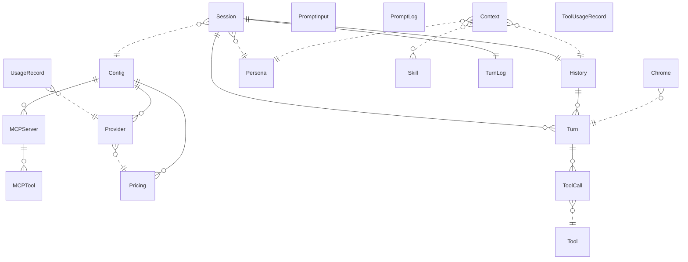

{/* Generated by `modelith render`. Do not edit by hand; edit the .modelith.yaml source and re-render. */}

# tellme — Multi-Provider Reasoning Agent (POSIX CLI)

A disciplined, POSIX/bash-only re-creation of tell-me-go. A CLI that turns a prompt into a multi-round reasoning turn: it assembles a provider payload (persona + matched skills + recent history + the prompt), drives a bounded think→act→observe loop against a multi-provider `Provider` (OpenAI-compatible, Anthropic, Gemini), executes agent `Tool`s, streams a diagnostic `Chrome`, and persists the session. Three operator-declared directions shape it: **no security layer**, **no Windows**, and **bash-first** — hence a deliberately small tool surface.

## Glossary

- **`Chrome`** — The diagnostic surface written to `stderr` on a turn: the turn rule/header, the payload status lines, the `[Tool …]` lines, the `[Tool Output]` block, the spinner, and the Ready summary. Terminal-gated accents are colour; the rest is plain text. Distinct from the answer, which is the rendered Markdown on `stdout`.
- **`NoSecurityLayer`** — A settled exclusion, not an omission: tellme ships **no** SafePath authorization, consent prompt, command whitelist, or path boundary. Tools read, write, and execute whatever they are given; the resulting risk is an explicitly accepted operator decision. The reference's SecurityManager / UserInteractor are therefore **absent** from this model.
- **`Orchestrator`** — The turn driver: it assembles the `Context`, calls the selected `Provider`, dispatches `ToolCall`s in a bounded loop, renders the `Chrome`, and persists the `Turn`. In the code it is `internal/agent`'s loop, reached through the injected domain port `agentport.Loop` (ADR 0019), so the CLI names no `internal/agent` identifier.
- **`Persona`** — The agent identity for a session — a MODE (e.g. `butler`) plus a PERSON system prompt, read from the `Config`. `TELL_ME_MODE` selects the mode for the offline session commands. The in-group peer agents (`pm`, `rd`, `architect`, `coder`, `griller`) are sibling personas of the same manager.
- **`TellMeHome`** — The filesystem root for all tellme state — `$TELL_ME_HOME` — holding the `docs/skills/` catalog, the per-mode `output/<mode>/` workspaces (history, turns log, usage log), and configs. Managed by the external Niffler script (see the environment-management model); tellme treats it as the stable namespace for everything it persists. Two artifacts live **outside** it, in the user-global `~/.tellme/` root: the shared prompt log and the tool-usage log.

## Enums

### `PayloadStatusKind`

The two payload figures the `Chrome` reports per `Turn`.

| Value | Definition |
| --- | --- |
| `estimated` | The pre-flight estimate (`~<n>`), computed before the provider call. |
| `measured` | The post-turn measured count, from the provider's usage report. |

### `ProviderFamily`

The wire-protocol family backing a `Provider` — the compile-time-safe dispatch dimension, distinct from the user-facing provider label (which may name an OpenAI-compatible vendor).

| Value | Definition |
| --- | --- |
| `openai` | OpenAI-compatible (covers openai, deepseek, kimi, and any OpenAI-protocol vendor). |
| `anthropic` | Anthropic Messages API. |
| `gemini` | Google Gemini / Vertex AI. |

### `ToolOutcome`

The recorded fate of one executed `ToolCall`.

| Value | Definition |
| --- | --- |
| `ok` | The tool ran; the result is kept (including a bounded/truncated result). |
| `error` | The tool returned a non-nil error. |
| `timeout` | The per-call deadline expired; the tool returned a nil-error "stopped" result. |

## Entities

### `Chrome`

The diagnostic surface on `stderr`: the turn rule and header, the payload status lines (`estimated` + `measured`), the `[Tool Reason]` / `[Tool Action]` / `[Tool Result]` lines, the live `[Tool Output]` block, the turn spinner, and the Ready summary. Colour accents are **terminal-gated** (a terminal `stderr` with `-r` off) and never enter `stdout` or the `TurnLog`; the `[Tool …]` values are control-free and bounded; the answer (`stdout`) is separately rendered Markdown.

**Relationships**

- `Turn` — n:1 — referenced

**Attributes**

| Name | Type | Description |
| --- | --- | --- |
| `colour` | boolean | Whether terminal-gated accents are on. |
| `payloadFigure` | PayloadStatusKind | The kind of the last payload figure the chrome reported. |

**Invariants**

- **chrome-colour-terminal-gated** — Colour appears only on a terminal `stderr` with `-r` off — never in `stdout` or `turns.log`.
- **chrome-tool-values-control-free** — Every `[Tool …]` value is folded, control-free, and rune-capped.
- **chrome-spinner-sample-cadence** — The spinner's braille frame stays on its fast cadence while its resource figures refresh at most once per second.

### `Config`

The YAML configuration loaded at startup (the `-c` path, else the default). It carries the `Persona` (MODE/PERSON), the `Provider` registry plus `SELECTED_PROVIDER`, per-model `Pricing`/context-window overrides, the tool-resource defaults, the session limits (`MAX_TOOL_LOOP`, `MAX_HISTORY_TOKENS`, `WRAP_WIDTH`, the HTTP timeout), and the `MCPServer` declarations. `${VAR}` placeholders are expanded at load. It carries **no** security/consent keys — the no-security-layer direction.

**Relationships**

- `Provider` — 1:n — owned — The provider registry (YAML PROVIDERS).
- `Pricing` — 1:n — owned — Per-model overrides (YAML MODELS).
- `MCPServer` — 1:n — owned — Configured external MCP servers (YAML `MCP_SERVERS`).

**Attributes**

| Name | Type | Description |
| --- | --- | --- |
| `mode` | string | The persona identity (YAML MODE). |
| `selectedProvider` | string | Registry key of the active `Provider`. |
| `maxToolLoop` | integer | Bound on tool rounds within one `Turn` (YAML `MAX_TOOL_LOOP`). |
| `maxHistoryTokens` | integer | Token budget for the retained `Context`. |

**Invariants**

- **config-selected-provider-resolves** — `selectedProvider` MUST reference a key in the `Provider` registry.
- **config-no-security-keys** — `Config` carries no security/consent keys — there is no authorization surface.

### `Context`

The provider payload assembled before each `Turn`: the `Persona` system prompt, any matched `Skill` content, the recent `History`, and the current prompt. Its size is reported by the `Chrome` as an estimate before the call and a measurement after it, against the effective budget.

**Relationships**

- `Persona` — n:1 — referenced
- `Skill` — n:n — referenced
- `History` — n:1 — referenced

**Invariants**

- **context-figures-reported** — The `Context`'s size is reported twice per turn — an `estimated` pre-flight figure and a `measured` post-turn figure.

### `History`

The persisted record of a session's completed `Turn`s — an append-only JSON-Lines file `history.jsonl` under `output/<mode>/`, plus an archive (`history.archive.jsonl`). One line per completed turn; a resumed session replays the stored steps (and their `signature`s) into the conversation.

**Relationships**

- `Turn` — 1:n — owned

**Attributes**

| Name | Type | Description |
| --- | --- | --- |
| `line` | object | A turn line `{prompt, answer, steps[], calls}`. |

**Invariants**

- **history-append-after-complete** — A `Turn` is persisted only after it completes (append-only).

### `MCPServer`

An external MCP server declared under `MCP_SERVERS` — reached over a remote URL or spawned as a local stdio child. Its tools are relayed to the model **verbatim** (tellme never rewrites the server's names/descriptions/ schemas); tellme offers its own `{reason, MCP_PAYLOAD}` envelope so a `reason` is always present.

**Relationships**

- `MCPTool` — 1:n — owned — Tools discovered from this server.

**Attributes**

| Name | Type | Description |
| --- | --- | --- |
| `name` | string | The unique server key. |
| `transport` | string | One of: `url` (remote) or `command` (local stdio). |

**Invariants**

- **mcp-server-definition-preserved** — An `MCPServer`'s own tool definitions are relayed verbatim — never altered.
- **mcp-token-never-logged** — MCP credentials/headers MUST never be logged.

### `MCPTool`

A tool discovered from an `MCPServer`. The model must call it as tellme's own envelope `{reason, MCP_PAYLOAD}`; only `MCP_PAYLOAD` is forwarded to the server, and a call that is not a valid envelope is refused before the server is contacted.

**Invariants**

- **mcp-call-is-an-envelope** — An MCP call MUST be a `{reason, MCP_PAYLOAD}` envelope; a non-envelope call is refused.
- **mcp-payload-forwarded-alone** — Only `MCP_PAYLOAD` reaches the server.

### `Persona`

The agent's identity for a session — a MODE and a PERSON system prompt. It is injected as the system message on every turn. The offline commands select a persona by mode.

**Attributes**

| Name | Type | Description |
| --- | --- | --- |
| `mode` | string | The persona identity. |
| `person` | string | The system prompt. |

**Invariants**

- **persona-injected-every-turn** — A session's `Persona` is injected as the system message on every turn.

### `Pricing`

The per-model cost + context-window table. It maps a model id to a context window and the per-million-token rates; the effective token budget for a session derives from the configured `MAX_HISTORY_TOKENS` and the active model's window.

**Attributes**

| Name | Type | Description |
| --- | --- | --- |
| `modelName` | string | The model id this row applies to. |
| `contextWindow` | integer | Maximum token capacity for the model. |

**Invariants**

- **pricing-unique-model** — Each `modelName` appears at most once in the pricing table.

### `PromptInput`

The operator's input surface: the positional argument(s) and/or piped stdin (bounded 1 MiB), the plain multi-line terminal reader, and the opt-in interactive TUI prompt (`-i`) with a debounced suggestion engine. It is a behavioural role, not persisted state.

**Attributes**

| Name | Type | Description |
| --- | --- | --- |
| `interactive` | boolean | Whether the opt-in TUI prompt is engaged. |

**Invariants**

- **prompt-input-interactive-needs-a-terminal** — The interactive prompt engages only when `-i` is set AND stdin is a terminal.

### `PromptLog`

The shared, user-global prompt log at `~/.tellme/global_prompts.jsonl` — one `{timestamp, prompt}` JSON line per entered prompt. It seeds the `-i` suggestion engine (read newest-first, deduped); it is written only under `-i`, and seeded once from the environment-scoped file when absent.

**Invariants**

- **prompt-log-written-only-interactively** — The shared prompt log is written only under the `-i` prompt.

### `Provider`

An LLM backend reachable via one ProviderFamily. It carries a model id, a base URL, authentication, and optional thinking settings; one is selected per session from the `Config` registry. tellme speaks the three families through thin transports; a vendor is just a label mapping to a family.

**Relationships**

- `Pricing` — n:1 — referenced — The per-model pricing/window the `Provider`'s model resolves to.

**Attributes**

| Name | Type | Description |
| --- | --- | --- |
| `label` | string | The free-form provider label (e.g. `deepseek`, `kimi`). |
| `family` | ProviderFamily | _Derived:_ Resolved from the label. |
| `model` | string | The model identifier sent on the wire. |

**Invariants**

- **provider-label-resolves-to-one-family** — Every provider label MUST resolve to exactly one ProviderFamily.

### `Session`

One conversation under a per-mode workspace. It owns the `History`, the `TurnLog`, and the `UsageRecord` stream, all under the `TellMeHome` (`$TELL_ME_HOME`) subtree `output/<mode>/`; `--new` archives them and starts fresh. The offline readers (`-l`, `-t`, `--tool-usage`, prompt-less `--new`) resolve the mode as `TELL_ME_MODE` → the `-c` config's MODE → the default config's MODE → `butler`, and stay offline (a mode-only config parse).

**Relationships**

- `Turn` — 1:n — owned
- `History` — 1:1 — owned — Persisted record of this session's completed turns.
- `TurnLog` — 1:1 — owned — The per-session rendered-chrome text file (`turns.log`).
- `Persona` — n:1 — referenced — The persona the session runs under.
- `Config` — n:1 — referenced

**Attributes**

| Name | Type | Description |
| --- | --- | --- |
| `mode` | string | The persona identity this session runs under. |

**Invariants**

- **session-mode-resolves-deterministically** — A session's mode resolves by the fixed precedence `TELL_ME_MODE` → the `-c` config's MODE → the default config's MODE → `butler`.
- **session-offline-reads-stay-offline** — The offline readers (`-l`, `-t`, `--tool-usage`, prompt-less `--new`) make no provider request.

### `Skill`

A guidance block (a SKILL.md file) under the `$TELL_ME_HOME/docs/skills/` catalog. It is listed by the `list_skills` tool and its content is injected into the `Context` when the prompt matches it. Skills are authored as the BDD workflow's executable SOPs.

**Relationships**

- `Context` — n:n — referenced — A matched skill's content is injected into the context.

**Attributes**

| Name | Type | Description |
| --- | --- | --- |
| `name` | string | The unique skill identifier (frontmatter `name`). |
| `description` | string | Human-readable summary (frontmatter `description`). |

**Invariants**

- **skill-unique-name** — A `Skill`'s name is unique across the catalog; the loader resolves a duplicate by keeping the first discovered and dropping the later one silently (no error).

### `Tool`

A capability the model may invoke, advertised with a JSON argument schema. The surface is deliberately small: the reader trio (`list_files`, `read_files`, `get_tree`), the write pair (`write_file`, `replace_text`), `execute_command` (`bash -c`), and `list_skills`. Every tool is bounded by the resource contract (`max_output_tokens` / `timeout` — default + param + ceiling) and requires a `reason`. There is no consent gate and no path boundary.

**Attributes**

| Name | Type | Description |
| --- | --- | --- |
| `name` | string | The unique wire tool name. |
| `requiresReason` | boolean | Always true — every tool call must carry a reason. |

**Invariants**

- **tool-name-unique** — Each `Tool` has a unique name.
- **tool-result-bounded** — Every tool bounds its own output at the source; the loop clamp is the backstop.

### `ToolCall`

One `Tool` invocation requested by the model during a `Turn`: the tool name, its arguments, its result, its ToolOutcome, and (when the provider emits one) its `signature`. Every tool call MUST carry a `reason` — the universal *no reason, no go* gate refuses a call whose reason does not render, folding a recoverable result back to the model.

**Relationships**

- `Tool` — n:1 — referenced — The tool the call resolves to in the registry.

**Attributes**

| Name | Type | Description |
| --- | --- | --- |
| `tool` | string | The wire tool name. |
| `reason` | string | The model-authored justification; required by the universal gate. |
| `outcome` | ToolOutcome | The recorded fate of the call. |

**Invariants**

- **call-requires-a-reason** — A tool call MUST carry a renderable `reason`; a reason-less call is refused (it never executes).
- **call-outcome-classified-structurally** — `outcome` is classified from the tool error and the loop-owned per-call deadline — never by sniffing the result text.

### `ToolUsageRecord`

One line per **executed** `ToolCall` in the user-global `~/.tellme/tools-count.jsonl`: `{timestamp, tool, outcome}`. It is global (never reset by `--new`) and read by the `--tool-usage` flag, which prints per-registry-tool invocation counts.

**Invariants**

- **tool-usage-global-and-best-effort** — The tool-usage log is global and best-effort — a write failure never breaks a turn.

### `Turn`

One atomic exchange: the prompt, zero or more provider rounds (interleaved with `ToolCall` execution), and a final answer. A turn is bounded by `MAX_TOOL_LOOP` tool rounds. On completion it is persisted as a single `history.jsonl` line `{prompt, answer, steps[], calls}` — the provider's answer text verbatim (content, not the rendered form). Each executed step records its provider `signature` when the provider emits one, so a resumed session replays faithfully.

**Relationships**

- `ToolCall` — 1:n — owned
- `Session` — n:1 — referenced

**Attributes**

| Name | Type | Description |
| --- | --- | --- |
| `prompt` | string | The user's input text. |
| `answer` | string | The provider's final answer text (verbatim). |
| `callCount` | integer | The number of AI-endpoint calls this turn made (stored as `calls`). |

**Invariants**

- **turn-bounded-by-tool-loop** — The tool rounds within one `Turn` MUST NOT exceed `Config.maxToolLoop`.
- **turn-answer-stored-verbatim** — A `Turn`'s persisted `answer` is the provider's content, never the rendered form.

### `TurnLog`

The per-session plain-text file `output/<mode>/turns.log`: the subset of the rendered `Chrome` routed through the sink (the turn rule/header, the payload status lines, the grouped `[Tool Reason]` lines, the metrics line, and the Ready summary). It is written best-effort and read by the `-t` flag; the input-capture ack, prompt echo, errors, spinner, and the `[Tool Output]` block are not persisted.

**Invariants**

- **turns-log-content-equal-but-plain** — `turns.log` follows the chrome's content but carries no colour.

### `UsageRecord`

One record per provider call in the per-mode `tokens.log`: the token breakdown and the cost. The Ready summary sums them into the session token totals and cost.

**Relationships**

- `Provider` — n:1 — referenced

**Invariants**

- **usage-summed-for-the-ready-summary** — The Ready summary's session totals are the sum of the session's `UsageRecord`s.

## Relationships

## Invariants

- **no-security-layer** — `NoSecurityLayer` — tellme has no authorization/consent surface; tools act on whatever they are given (an accepted operator decision).
- **posix-bash-only** — tellme targets bash on POSIX only — no Windows variant.
- **deterministic-and-hermetic** — Behaviour is deterministic; `make verify` is hermetic (ADR 0012).

## Scenarios

### A prompt turn

The user runs tellme with a prompt. The `Orchestrator` assembles the `Context`, shows the estimated payload line, calls the selected `Provider`, renders the answer, reports the measured payload + the Ready summary, and persists the `Turn`.

**Actors:** Orchestrator, Config, Provider, Context, Chrome, Session, Turn

**Steps**

1. The user passes a prompt as an argument (and/or piped stdin).
2. `Orchestrator` resolves the `Persona` and the `Provider` from the `Config`.
3. `Orchestrator` assembles the `Context` and emits the `estimated` payload line.
4. `Provider` returns the answer (a text Thought).
5. The answer is rendered to `stdout`; the `Chrome` emits the `measured` line + the Ready summary.
6. `Orchestrator` persists the `Turn` to the `History` and records a `UsageRecord`.

**Invariants touched**

- **turn-answer-stored-verbatim** — A `Turn`'s persisted `answer` is the provider's content, never the rendered form.
- **history-append-after-complete** — A `Turn` is persisted only after it completes (append-only).
- **context-figures-reported** — The `Context`'s size is reported twice per turn — an `estimated` pre-flight figure and a `measured` post-turn figure.

### A tool-using turn

The model requests `execute_command`. Because the tool carries a `reason`, the loop runs it, streams the `[Tool Output]` block (grey on a terminal), folds the result back, and repeats until the final answer.

**Actors:** Orchestrator, Tool, ToolCall, Chrome, Session

**Steps**

1. `Provider` returns a tool call to `execute_command` carrying a `reason`.
2. The universal gate accepts the call (the reason renders).
3. The tool runs through `bash -c`, bounded by the resource contract.
4. The `Chrome` streams the `[Tool Output]` block to `stderr`.
5. The result is folded back; the loop repeats until a final answer.

**Invariants touched**

- **call-requires-a-reason** — A tool call MUST carry a renderable `reason`; a reason-less call is refused (it never executes).
- **tool-result-bounded** — Every tool bounds its own output at the source; the loop clamp is the backstop.
- **chrome-tool-values-control-free** — Every `[Tool …]` value is folded, control-free, and rune-capped.

### A reason-less call is refused

The model requests a tool without a renderable reason. The universal gate (single-owned by the round-046 renderer) refuses the call — the tool does not execute — and folds a recoverable result asking the model to retry.

**Actors:** Orchestrator, ToolCall

**Steps**

1. `Provider` returns a tool call with no renderable `reason`.
2. The gate refuses the call; the tool does not execute.
3. A recoverable `tool`-role result asking for a `reason` is folded back.

**Invariants touched**

- **call-requires-a-reason** — A tool call MUST carry a renderable `reason`; a reason-less call is refused (it never executes).

### Resuming a session

A later process reads `history.jsonl` and replays the stored turns, including each step's provider `signature`, so a tool-using session resumes faithfully.

**Actors:** Session, History, Turn, Context

**Steps**

1. A new process loads the session's `History`.
2. The stored `Turn`s (with their steps + signatures) are replayed into the `Context`.
3. The next `Turn` proceeds against the resumed conversation.

**Invariants touched**

- **history-append-after-complete** — A `Turn` is persisted only after it completes (append-only).

### An MCP tool call

The model calls an MCP-backed tool. It must be tellme's own `{reason, MCP_PAYLOAD}` envelope; only the payload reaches the server.

**Actors:** MCPServer, MCPTool, ToolCall, Orchestrator

**Steps**

1. `Provider` returns a call to an `MCPTool`.
2. The call is checked to be a `{reason, MCP_PAYLOAD}` envelope.
3. Only `MCP_PAYLOAD` is forwarded to the `MCPServer`.

**Invariants touched**

- **mcp-call-is-an-envelope** — An MCP call MUST be a `{reason, MCP_PAYLOAD}` envelope; a non-envelope call is refused.
- **mcp-payload-forwarded-alone** — Only `MCP_PAYLOAD` reaches the server.
- **mcp-server-definition-preserved** — An `MCPServer`'s own tool definitions are relayed verbatim — never altered.

### Listing and using skills

A prompt matches a `Skill`; its guidance is injected into the `Context`. The model can also enumerate the catalog with the `list_skills` tool.

**Actors:** Skill, Context, Orchestrator, Tool

**Steps**

1. The user's prompt matches a `Skill`'s keywords.
2. `Orchestrator` injects the matched `Skill`'s content into the `Context`.
3. The `list_skills` `Tool` lists the catalog on request.

**Invariants touched**

- **skill-unique-name** — A `Skill`'s name is unique across the catalog; the loader resolves a duplicate by keeping the first discovered and dropping the later one silently (no error).

### The budget tracks the model

The effective token budget for a session derives from the configured `MAX_HISTORY_TOKENS` and the active model's `Pricing` window, and bounds the `Context` reported by the `Chrome`.

**Actors:** Pricing, Config, Context, Provider

**Steps**

1. `Config` names the selected `Provider` and the configured `MAX_HISTORY_TOKENS`.
2. The active model's `Pricing` supplies its context window.
3. The effective budget is the smaller of the two.
4. The `Context` is reported against the effective budget.

**Invariants touched**

- **pricing-unique-model** — Each `modelName` appears at most once in the pricing table.
- **context-figures-reported** — The `Context`'s size is reported twice per turn — an `estimated` pre-flight figure and a `measured` post-turn figure.

### Reading the session's logs

The offline readers surface the session's rendered chrome and the cumulative tool usage without any provider request.

**Actors:** Session, TurnLog, ToolUsageRecord, History

**Steps**

1. `-t` prints the session's `TurnLog` (`turns.log`).
2. `--tool-usage` prints per-tool counts from the global `ToolUsageRecord` log.
3. `-l` prints the last persisted messages from the `History`.

**Invariants touched**

- **turns-log-content-equal-but-plain** — `turns.log` follows the chrome's content but carries no colour.
- **tool-usage-global-and-best-effort** — The tool-usage log is global and best-effort — a write failure never breaks a turn.
- **session-offline-reads-stay-offline** — The offline readers (`-l`, `-t`, `--tool-usage`, prompt-less `--new`) make no provider request.

### An interactive prompt

With `-i` on a terminal, the session's `PromptInput` collects a prompt with live suggestions, and the entered prompt is appended to the shared `PromptLog`.

**Actors:** PromptInput, PromptLog, Skill, Session

**Steps**

1. `PromptInput` engages the TUI prompt (a terminal stdin).
2. The suggestion engine seeds from the `PromptLog`, the session, the workspace, and the tool registry.
3. The entered prompt is appended to the shared `PromptLog`.

**Invariants touched**

- **prompt-input-interactive-needs-a-terminal** — The interactive prompt engages only when `-i` is set AND stdin is a terminal.
- **prompt-log-written-only-interactively** — The shared prompt log is written only under the `-i` prompt.

